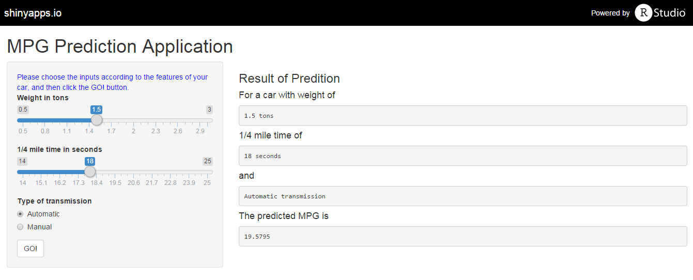

MPG Prediction Application
========================================================
author: Yisong Li
date: April 26th, 2015
transition: rotate

[Project Repo](https://github.com/liyisong1028/FirstShinyApp)

<small>
Crosby MBA Program<br>
Trulaske College of Business<br>
University of Missouri
</small>

Application Overveiw
========================================================

The application estimates the MPG of cars reactively with following inputs
- Car weight
- 1/4 mile time
- Transmission type

User Interface
========================================================
- Intuitive layout. 
- User friendly input methods
- Clear output display



Predictive Model
========================================================
- Multivariable linear regression model
- The algorithm used to estimate MPG is

```r
MPGpred <- function(wt, qsec, am) 18.088-5.873*(wt-1)+5.797*am+1.107*(qsec-14)-8.283*wt*am
```
- For a car weigh 1 ton, has 1/4 mile time of 14 seconds, and has automatic transmission, its MPG will be estimated to be

```r
wt<-1; qsec<-14; am<-0
MPGpred(wt, qsec, am)
```

```
[1] 18.088
```

More Details
========================================================
- The model is built using the `mtcars` dataset
- It is the project of Regression Model course
- The coefficient table of the model showed below

```
             Estimate Std. Error   t value     Pr(>|t|)
(Intercept) 18.087621  1.8742982  9.650343 3.029926e-10
wt          -5.873062  1.3320506 -4.409038 1.488947e-04
am           5.796675  1.4538422  3.987142 4.578773e-04
qsec         1.016974  0.2520152  4.035366 4.030165e-04
wt:am       -8.282753  2.3936238 -3.460340 1.808576e-03
```
